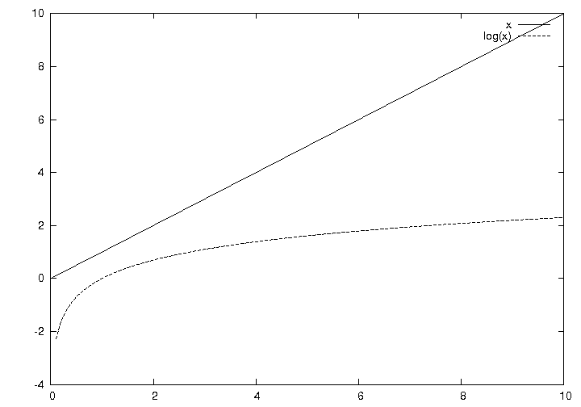
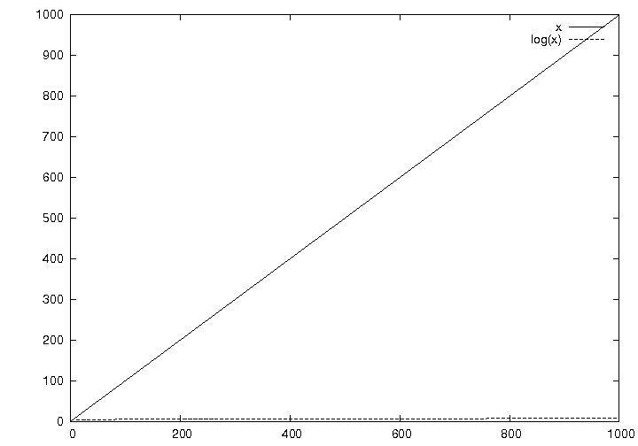

!SLIDE
# Basic Index
## fast lookup

!SLIDE
# Sequential Search
## O(n)

!SLIDE
# B-Tree Search
## O(log(n))

!SLIDE center

!SLIDE center

!SLIDE center

!SLIDE
# Romeo and Juliet
## One DB record for each line
## 1000 random queries

!SLIDE
# Results
              without index 5.54576
              with index    0.787138
              speedup       704%

!SLIDE
# Easy to setup
    @@@ sql
    create index my_id on my_table(my_column);

