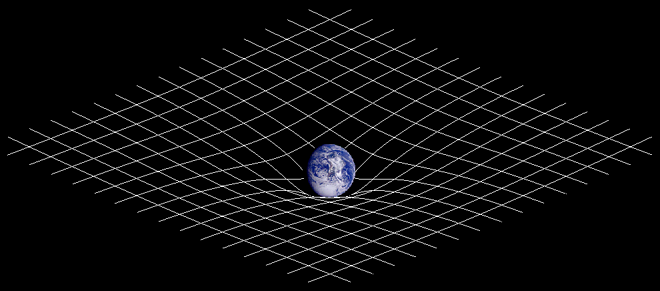

!SLIDE
# Chapter 3
## Geospatial

!SLIDE center
# Not your typical index

#### [http://en.wikipedia.org/wiki/K-d\_tree](http://en.wikipedia.org/wiki/K-d_tree)

!SLIDE center
# PostGIS
## Geospatial indexing and querying for PostgreSQL

!SLIDE
# Easy Install
    @@@ 
    apt-get install postgresql-8.4-postgis
    
    brew install postgis gdal

!SLIDE
# Setup the language
### Navigate to system directory for postgis.sql
### e.g. /usr/share/postgresql/8.4/contrib/postgis-1.5
    @@@ sql
    createdb my_db
    createlang plpgsql my_db
    psql -d my_db -f postgis.sql
    psql -d my_db -f spatial_ref_sys.sql
    psql -d my_db -f postgis_comments.sql

!SLIDE
# Setup your database
    @@@ ruby
    create_table :points do |t|
      t.string :name
    end
    execute %{
      SELECT AddGeometryColumn(
        'points', 'location', 
        4326, 'POINT', 2
      );
      CREATE INDEX points_location_idx 
        ON points USING GIST (location);
    }

 
!SLIDE
# Create a point
    @@@ ruby
    point = Point.create(
      :name => "New York",
      :location => Point.from_lon_lat(
        -74.009399,40.708751
      )
    )
    point.reload
    point.location.lat
      => 40.708751
 
!SLIDE
# Find points in a radius
    @@@ ruby
    Point.where(%{
      ST_Distance(
        location,
        ST_GeomFromText('POINT(-76 39)')
      ) < 1
    });

!SLIDE
# In Rails
## GeoRuby
### [http://georuby.rubyforge.org/](http://georuby.rubyforge.org/)
## Spatial Adapter
### [http://github.com/fragility/spatial\_adapter](http://github.com/fragility/spatial_adapter)

!SLIDE bullets
# Will it blend?
* 8,000,000 points
* 5 years of data
* Single EC2 Large @ 2000rpm
* Query: "What happened on my block last week?"

!SLIDE
# Avg 23ms response time
## Database: 2.0ms
## ActiveRecord: 6.8ms
## Controller action + JSON: 14ms

!SLIDE center
# Remember compound indices from chapter 1?
## Compound index on space and time

#### [http://en.wikipedia.org/wiki/Spacetime](http://en.wikipedia.org/wiki/Spacetime)

!SLIDE
# There's more
### Lines and polygons
### Intersection operations
### Partial and full containment
### Distance calculation
### Area computation

